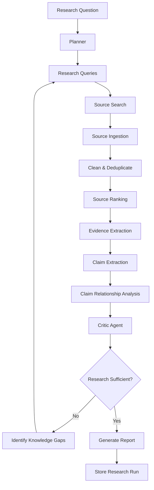
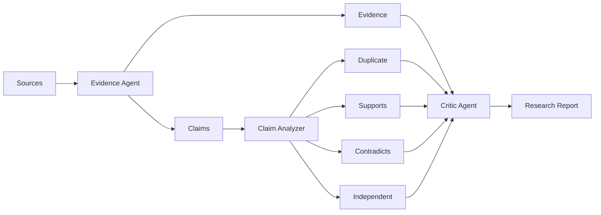

# Axiom — Autonomous AI Research System

Axiom is an **autonomous AI research system** that takes a research question, plans an investigation, gathers and evaluates sources, extracts evidence and claims, analyzes relationships between claims, critiques the research, and generates a structured research report.

Instead of producing a single LLM response, Axiom uses a **multi-stage research pipeline** designed to improve evidence grounding, source evaluation, and research reliability.

---

## What Axiom Does

Given a research question such as:

> **Does RAG reduce hallucinations in LLMs?**

Axiom automatically:

1. Creates a structured research plan.
2. Generates targeted search queries.
3. Searches and ingests relevant sources.
4. Cleans and deduplicates sources.
5. Ranks sources using relevance and quality scores.
6. Extracts claims and supporting evidence.
7. Analyzes relationships between claims.
8. Detects contradictions and duplicate claims.
9. Uses a critic agent to identify weaknesses and knowledge gaps.
10. Performs follow-up research when evidence is insufficient.
11. Generates a citation-aware research report.
12. Stores the complete research run for inspection.

---

## Architecture

```text
                         Research Question
                                │
                                ▼
                           ┌─────────┐
                           │ Planner │
                           └────┬────┘
                                │
                         Search Queries
                                │
                                ▼
                         ┌────────────┐
                         │ Researcher │
                         └─────┬──────┘
                               │
                         Search + Ingest
                               │
                               ▼
                     ┌──────────────────┐
                     │ Source Management│
                     └────────┬─────────┘
                              │
                       Clean + Deduplicate
                              │
                              ▼
                       ┌─────────────┐
                       │Source Ranker│
                       └──────┬──────┘
                              │
                    Relevance + Quality
                              │
                              ▼
                      ┌───────────────┐
                      │Evidence Agent│
                      └───────┬───────┘
                              │
                    ┌─────────┴─────────┐
                    ▼                   ▼
                 Claims              Evidence
                    │                   │
                    ▼                   │
              Claim Analyzer            │
                    │                   │
                    └─────────┬─────────┘
                              ▼
                        Critic Agent
                              │
                              ▼
                       Research Loop
                              │
                              ▼
                        Report Agent
                              │
                              ▼
                      Markdown Report
                              │
                              ▼
                         FastAPI API
                              │
                              ▼
                       React Dashboard
```

---

## Autonomous Research Flow

Axiom performs iterative research instead of relying on a single search-and-answer cycle.



---

## Evidence & Claim Pipeline

Claims are separated from their supporting evidence and analyzed for relationships.



---

## Source Ranking

Axiom evaluates sources using two signals:

* **Relevance** — how closely the source matches the research question.
* **Quality** — how authoritative or reliable the source is.

```text
Final Score
    =
    0.70 × Relevance
    +
    0.30 × Quality
```

Example quality signals:

| Source Type               | Quality |
| ------------------------- | ------: |
| Academic / research paper |    1.00 |
| Nature / Science          |    1.00 |
| ACM / IEEE                |    0.95 |
| Government sources        |    0.90 |
| Documentation             |    0.90 |
| GitHub                    |    0.80 |
| General article           |    0.45 |
| Unknown source            |    0.30 |

---

## Core Components

| Component           | Responsibility                                        |
| ------------------- | ----------------------------------------------------- |
| **Planner**         | Creates objectives, sub-questions, and search queries |
| **Researcher**      | Searches for and collects relevant sources            |
| **Source Ingestor** | Retrieves and processes source content                |
| **Source Manager**  | Cleans and deduplicates sources                       |
| **Source Ranker**   | Calculates relevance and quality scores               |
| **Evidence Agent**  | Extracts evidence and claims                          |
| **Claim Analyzer**  | Detects relationships between claims                  |
| **Critic Agent**    | Evaluates research sufficiency and knowledge gaps     |
| **Research Loop**   | Coordinates iterative research                        |
| **Report Agent**    | Synthesizes findings into a final report              |
| **FastAPI API**     | Exposes the research system                           |
| **React Dashboard** | Provides the research interface                       |

---

## Key Features

* Autonomous multi-step research
* Iterative research with stopping criteria
* Structured claims and evidence
* Source quality and relevance scoring
* Claim contradiction and duplicate detection
* Evidence caching
* Source caching
* Citation-aware Markdown reports
* Persistent research runs
* REST API
* Interactive research dashboard
* Automated test suite

---

## Tech Stack

**Backend**

* Python
* FastAPI
* Pydantic
* Google Gemini API
* Tavily Search
* Pytest

**Frontend**

* React
* Vite
* Tailwind CSS
* React Router
* React Markdown
* Lucide React

**Architecture**

* Multi-agent system
* Iterative research loop
* Structured LLM outputs
* Background execution
* REST API
* File-based persistence

---

## Running Locally

### Clone

```bash
git clone https://github.com/Abhra0404/Axiom--Autonomous-AI-Research-System.git

cd Axiom--Autonomous-AI-Research-System
```

### Backend

```bash
python -m venv venv
source venv/bin/activate

pip install -r requirements.txt
```

Create `.env`:

```env
GEMINI_API_KEY=your_gemini_api_key
TAVILY_API_KEY=your_tavily_api_key
GEMINI_MODEL=gemini-3.5-flash
```

Run research:

```bash
python -m app.run "Does RAG reduce hallucinations in LLMs?"
```

Start the API:

```bash
uvicorn app.api.main:app --reload
```

### Frontend

```bash
cd frontend

npm install
npm run dev
```

---

## License

This project is open source and available under the MIT License.
